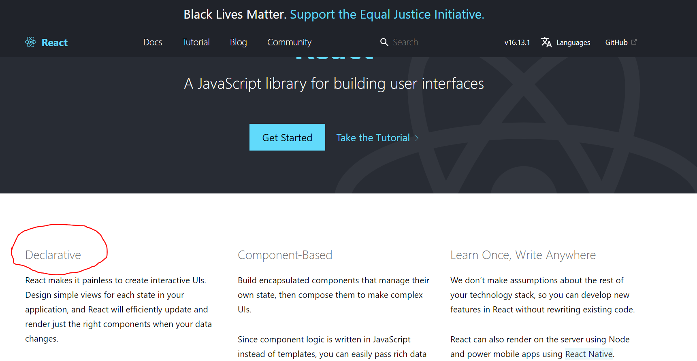

> Em nói em thích làm với React và muốn được thực tập ở vị trí ReactJS Developer. Vậy tại sao em thích nó? Nó hay ở chỗ nào mà em, và thậm chí là rất nhiều người, công ty đang yêu thích và sử dụng React?

Mình nghĩ thầm trong bụng:

> Dạ tại em mới học làm web, lên mạng ‘gô gồ’ thấy React đang hot, lương cao, việc nhiều, … Chứ em mới học, có biết gì đâu anh ơi :D.

Nghĩ là vậy thôi, chứ trả lời nó phải ra ngô ra khoai để người ta còn nhận mình chứ vầy thì tạch mất.

> Dạ, React nó sử dụng DOM ảo, nó nhanh, không có làm với DOM thuần, nó “học một lần, viết tùm lum” (Learn Oce, Write Anywhere), chia nhỏ theo cấu trúc Component (Component-Based) và viết code theo hướng Declarative giúp dễ đọc, dễ hiểu.

> Ừm, ok, vậy cho anh biết viết code declarative hay declarative programming là gì mà nó được xem như là một điểm mạnh của React em ha?

Vâng, tới đây thì mình chính thức tịt ngòi :D

Mến chào các bạn đã đến với blog “kỹ sự mặt tiền” ngày hôm nay. Câu chuyện trên là thật, và nó là cuộc phỏng vấn của mình vào những ngày đầu học lập trình web.

Nhớ không lầm đó là thời điểm 3 tháng sau khi tập tò học lập trình web và phỏng vấn đi xin việc ở vị trí thực tập tại một công ty nọ. Và mình đã được học ngay những bài học đầu tiên - the hard way. Mình đã tạch các bạn ạ, tạch ngay từ thời điểm đi xin thực tập.

Mình tin rằng phần lớn đa số những người mới sẽ luôn phải đối mặt với các vấn đề khó khăn như thế, vì chính mình đã trải qua.

Với loạt bài viết trên trang blog này, mình hy vọng giúp ích được phần nào cho các bạn mới và đặc biệt cũng rất mong những ý kiến đánh giá, nhận xét của các bạn để mình hoàn thiện hơn, để chúng ta cùng nhau phát triển.

Vào chủ để chính thôi, **Declrative programming** chính là yếu tố đầu tiên mà đội ngũ phát triển ReactJS tự hào xem như là điểm mạnh của bản thân library này, và nó được show ngay ở trang chủ của React:

<div className='image-wrapper'>
    
</div>

_Declarative programming - một trong ba based-factors được React nhắc đến ngay trang chủ - Ảnh: reactjs.org_

Cụ thể, thưở sơ khai, khi các tiền bối web developers còn sống trong hang trong hốc (em giỡn :D), thao tác tất tần tật mọi thứ, nào gắn event listener, thêm, xóa, sửa, thao tác với “cây” DOM để thay đổi nội dung, xử lý các thao tác, vân vân và mây mây.

Đa số phong cách lập trình khi đó sẽ là **“Imperative programming”** (google dịch nôm na là “Lập trình mệnh lệnh”), cùng với jQuery, ajax, họ sống hạnh phúc bên nhau…

Cho đến lúc mỗi ngày mỗi phát triển, browser google V8 engine mạnh mẽ, web ngày càng nhiều tính năng, và việc handle một núi các thứ logic kia đã thực sự trở thành một thách thức, thì đội ngũ trai tài gái sắc phát triển ReactJS đã đem một làn gió mới đến với cộng đồng developers một library siêu phê với phong cách lập trình Declarative Programming (“Lập trình khai báo”).

Thực ra có nhiều các framework, thư viện, hay bản thân khái niệm declrative programming này đã có từ lâu rồi, nhưng mình thích nói về React.

Nói đơn giản, lập trình phong cách Imperative là chúng ta đi nói với máy tính làm thế nào, **HOW**, tui phải làm những gì để đạt được kết quả mà anh mong muốn.

Khác với điều này, lập trình Declarative là chúng ta đi nói với máy tính (ví dụ vậy thôi, chứ ai lại đi nói chuyện với máy tính ha các bạn :D) rằng chúng ta muốn làm gì, **WHAT** I want to have…

Lấy một ví dụ. Bạn và bạn gái đi vào quán phở:

Tới trước cổng, anh phục vụ ra chào bạn, và bạn nói: “Tôi thấy phía góc phải của quán còn một bàn trống, bằng cách đi ngang qua anh áo đen đang ngồi ăn phở, quẹo một góc 90 độ, kéo ghế ra và ngồi xuống, tôi sẽ có chỗ ngồi cho hai người dành cho tôi và bạn gái tôi” (Ví dụ thôi nha các bạn, đừng bao giờ vào quán phở nói kiểu “người cõi trên” như thế này nhe :D)

Đó chính là “Imperative”. Bạn miêu tả cách thực hiện, làm từng bước, làm sao, làm thế nào để đạt được kết quả bạn mong muốn. (Thứ lẽ ra là việc của anh nhân viên quán phở, quán của ảnh, ảnh rành hơn bạn đúng không nào :D).

Còn với “Declarative” programming thì mọi thứ sẽ là: “Chào anh! Tôi muốn chỗ cho 2 người”. Rồi phần việc của anh nhân viên sẽ là tìm chỗ nào còn trống và mời bạn ngồi, thế thôi.

## 1. JS Imperative way và React Declarative way

Về code, lấy ví dụ implement 1 button. Khi bấm vào button, button sẽ đổi màu giữa hai màu xanh và đỏ. Nếu đang xanh thì sẽ chuyển sang đỏ, nếu đang đỏ thì chuyển sang xanh.

<div class='iframe-centered'>
    <iframe src="https://giphy.com/embed/VHwngXdifvjAYXEv8f" width="480" height="210" frameBorder="0" class="giphy-embed" allowFullScreen></iframe>
</div>

Lập trình JavaScript Imperative way, thì bạn sẽ phải làm những thứ như sau:

```javascript
//Ok, tạo một biến nắm giữ DOM node body, dùng api-hàm querySelector
const body = document.querySelector('body');
//Tiếp tục, create một button bằng hàm createElement
const btn = document.createElement('button');
//Thêm text cho button bằng cách gán propterty “innerText” = …
btn.innerText = 'Nút kỳ diệu';
//Thêm default css cho button, default mới vào là màu đỏ
btn.className = 'btn red';
//Gán event onclick vào button vừa tạo, khi click vào button thì hàm này sẽ:
btn.onclick = function(event) {
  //Kiểm tra nếu list css class của button này (“this”) có chứa “red” (A)
  if (this.classList.contains('red')) {
    //Thì remove css class red này đi
    this.classList.remove('red');
    //Rồi add css class “blue” mới vào list
    this.classList.add('blue');
    //Ngược lại với ý (A), nếu ban đầu css class không chứa “red”, tức là đang chứa “blue”
  } else {
    //Thì remove class “blue” ra
    this.classList.remove('blue');
    //Rồi add class mới tên “red” vào
    this.classList.add('red');
  }
};
//Cuối cùng, gắn cái button này vào thân body của file html.
body.appendChild(btn);
```

Oh my god, mới chỉ là một dumb-function, tạo nút và click đổi màu thôi, mà đã có hàng tá bước xử lý.

Rồi với một app lớn, nhiều lớp giao diện, nhiều thao tác cần xử lý, load dữ liệu, v,v… thì thật quả là ác mộng khi viết code kiểu này đúng không các bạn.

Cách viết này giống như chúng ta đang hướng dẫn browser làm cái này làm cái kia, tạo biến này, nói chung là đi trình bày từng bước LÀM THẾ NÀO để đạt được kết quả mong muốn là một cái nút bấm chuyển màu qua lại.

Nhưng với React, chúng ta sẽ làm như sau:

```jsx
//Tôi muốn tạo một Button class component
class Button extends React.Component{
//Button này có một biến stat là color, thể hiện màu sắc background của nút, mặc định sẽ là đỏ
this.state = { color: 'red' }
//(A) Tạo biến local color, check tùy vào biến state color đang là gì, nếu đang là “red” thì local color = “blue” và ngược lại. Sau cùng set lại state color ứng với biến color mới khởi tạo vừa rồi.
    handleChange = () => {
        const color = this.state.color === 'red' ? 'blue' : 'red';
        this.setState({ color });
    }
    render() {
        return (
            {/*Render ra màn hình giúp tôi một thẻ div, trong thẻ div có một button*/}
            <div>
                {/*css classes của button này bao gồm “btn” và tùy vào trạng thái của biến state “color” mà sẽ add thêm “red” hay “blue” vào thêm sau “btn.*/}
                <button className={`btn ${this.state.color}`}>
                    {/*Mỗi khi click vào nút này thì tui muốn xử lý như sau (xem (A))*/}
                    onClick={this.handleChange}>
                </button>
            </div>
        );
    }
}
```

Ở cách viết này, chúng ta chỉ nói với React: “À, tui muốn nhờ anh render và quản lý dùm cái nút này.

Tùy vào trạng thái “color” state của nó mà anh đổi màu cho đẹp đep giúp tui nhé”.

Và yeah, React sẽ lo hết việc còn lại.

Thật ra, bản chất họat động behind the scene của React suy cho cùng cũng phải đi thao tác với DOM thật để render, vẽ lại cái nút kia, cũng sẽ có các bước createElement, change class list,… Nhưng cách React làm sẽ khác chúng ta, và nó làm điều này một cách nhanh, performance tối ưu hơn.

Thứ duy nhất chúng ta cần quan tâm và control đó là sự thay đổi của biến state “color”, và dựa trên “color” này, ta cân nói cái chúng ta muốn đạt được và React sẽ tự mình làm điều đó, bạn không cần quan tâm đến các bước “low-level” bên dưới, thật tuyệt vời.

Tùy vào mức độ thành thạo và việc bạn đã làm với JS vanilla nhiều hay không mà khi nhìn vào ví dụ bên trên, bạn sẽ thấy được lợi ích của cách viết này nhiều hay ít.

## 2. Thật ra Declarative Programming ở ngay quanh ta, từ những thứ nho nhỏ

Đề bài như sau: Cho một mảng A chứa numbers, viết một hàm nhận vào mảng này, và trả ra kết quả là một mảng mới B với các giá trị của phần tử của mảng bằng với giá trị của từng phần tử của A nhân cho 2.

**Imperative way:**

```javascript
function arrayHandler(array) {
  const results = [];
  for (let i = 0; i < array.length; i++) {
    results[i] = array[i] * 2;
  }
  return results;
}
```

**Declarative way:**

```javascript
function arrayHandler(array) {
  return array.map(element => element * 2);
}
```

Một lần nữa, ở cách viết Imperative, chúng ta tạo một mảng kết quả “results”, duyệt qua từng phần tử của mảng, từ vị trí index thứ 0 đến chiều dài của mảng, mỗi lần duuyệt qua ta lấy từng element nhân 2, chèn vào mảng kết quả.

Tóm lại, ta tiếp tục đi “hướng dẫn” máy tính các công việc cần thực hiện từng bước một, làm như thế nào để đạt được kết quả.

Còn với cách viết Declarative, ta biết rằng hàm “map” sẽ duyệt qua các phần tử trong mảng và trả ra một mảng mới. Tại đây, ta nói với máy tính rằng tôi muốn nhận về mảng mới với mỗi phần tử bằng phần tử của mảng gốc nhân cho 2.

Ít code và dễ đọc, dễ hiểu hơn đúng không các bạn. (À, còn tùy mức độ quen thuộc của bạn với các hàm của javascript nữa, “map” bên trên là một ví dụ).

Nhưng cơ bản ta hoàn toàn không quan tâm đến cách duyệt qua từng phần tử như thế nào, hay mảng kết quả đã được khởi tạo và trả ra như thế nào ngay bên trong hàm map.

## 3. Declarative code suy cho cùng cũng giống như một abstract layer (lớp ảo) - phủ lên trên đống code Imperative code.

Nếu tinh ý bạn sẽ nhận ra, với ví dụ về “map” function bên trên.

Hàm map đã được viết sẵn, rằng chúng ta không quan tâm đến cách nó được viết như thế nào, nhưng tận sâu bên trong cấu trúc của hàm map cũng sẽ có cơ chế duyệt mảng, do something, rồi trả ra mảng mới, có thể là một cách implement phức tạp, tối ưu performance hơn hàm duyệt mảng arrayHandler mà chúng ta viết đúng không nào?

Hay như với library ReactJS, với ví dụ đầu tiên khi implement button chuyển màu, thực chất React cũng sẽ phải khởi tạo biến, chạy hàm, sử dụng các thuật toán so sánh, oprimize performance, rồi sau cùng update cây DOM thật.

Nhưng một lần nữa, với cách quản lý state và cú pháp JSX, chúng ta hoàn toàn không hề can thiệp đến phần việc “low-level” ấy. Thật tuyệt vời!

## 4. Kết luận

Declarative cá nhân mình nhận định là một cách lập trình “thông minh”, thứ mà tự mỗi bản thân developer chúng ta mong muốn hướng tới, hay ít nhất là muốn làm việc với một framework, library có tính Declarative.

Declarative programming ngày nay đã trở nên khá phổ biến, với nhiều thư viện hay framework đã thực hiện như React, Vue, Angular, ….

Nhìn chung, chúng giúp che giấu các thao tác xử lý phức tạp và lặp đi lặp lại, giúp developer lập trình theo hướng ngắn gọn hơn, tối ưu hóa performance, code dễ đọc dễ hiểu hơn.

Thực chất để một người mới học, mới tìm hiểu lập trình nắm và hiểu được các định nghĩa, khái niệm, ‘terms’ như thế này khá là khó các bạn ạ. Nhưng thay vì lấy lý do mới học nên không tìm hiểu, cố gắng mỗi ngày luôn là cách để chúng ta phát triển phải không nào?

Bên cạnh việc làm được việc, có hiểu biết sâu và rộng về technical cũng là một điểm mạnh khiến bạn lọt vào mắt xanh nhà tuyển dụng. Mách bạn một tip nhỏ thì chính những kiến thức như thế này sẽ là tiêu chí để các anh senior phân loại ứng viên đấy.

Cảm ơn các bạn đã ghé đọc bài viết ngày hôm nay. Hẹn gặp lại các bạn trong những bài viết tiếp theo của mình nhé. Mến chào các bạn!
